Project Notebook
================
by MoonJam

## Introduction

In the spirit of J. Allen Hynek, now that the data are processed - it’s
have a look at what we can learn about the reported UFO sightings in the
last several decades. For the purpose of this exploration, I’m
maintaining a scope of 1947 to present - using the year of the Roswell
incident as our year one.

### Limitations

I should probably set this straight from the beginning: I am not
purporting to answer any questions, but rather just take the available
data and see what can be understood from the source as collected. I do
not have any means of validating the collected data nor do I have any
connection to NUFORC or any other UFO-related organization. I’m just a
guy who works with data and thinks this is a cool and interesting topic.

## Initial analysis

Starting with a basic glance at variable summaries, there is at least
one absurd outlier for the duration of a sighting. Because I processed
the data myself, I am aware of what variables are non-text and did not
choose to inspect the variables’ types. In the very least, we can at
least verify that reports sourced from MUFON account for a negligible
amount of the
    data.

    ##    Date/Time                      Duration         MUFON Report   
    ##  Min.   :1947-01-01 17:00:00   Min.   :      0.0   Mode :logical  
    ##  1st Qu.:2003-02-20 22:11:15   1st Qu.:     60.0   FALSE:115139   
    ##  Median :2009-06-30 14:00:00   Median :    180.0   TRUE :193      
    ##  Mean   :2006-12-11 14:01:26   Mean   :    773.4                  
    ##  3rd Qu.:2014-01-17 22:56:15   3rd Qu.:    480.0                  
    ##  Max.   :2019-03-29 07:53:00   Max.   :2988000.0

## UFO Sightings: When?

In *The UFO Experience*, J. Allen Hynek states that UFO sightings in the
1960s/1970s were on the rise. Recently, I have come across a number of
references to the lack of modern sightings in various comments, threads,
etc. for UFO-related media. Observing the number of sightings over time,
we can see that Hynek’s assertion seems reasonable considering a
publication date of 1972 for *The UFO Experience*. However, it looks
like there were two flaps occuring after 1994 and 2010 and subsequently
a steep decline since 2014. Despite this, it seems that the last decade
has had more reported UFO sightings than back in Hynek’s day. This may
also be due to the general availability of something like NUFORC over
the last few decades relative to the 1960s/1970s - we have more
documented sightings **because** there of access to a reporting center.
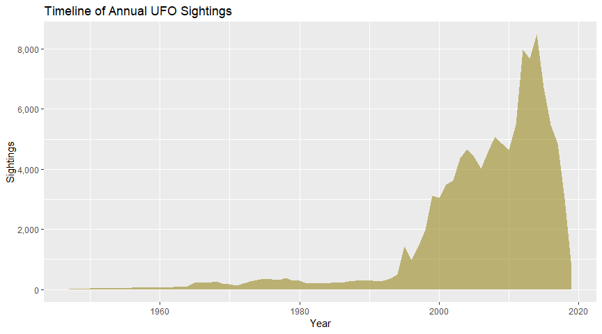<!-- -->

Knowing the trend in yearly sightings has changed substantially over the
last few decades, I thought it wise to inspect the distribution of
sightings by year. Limiting myself to just the United States (more on
this in a later section), we can see that the data fall in a non-normal
distribution. The bottom 50% of observed years reach about 242 sightings
with the bottom 75% hitting about 2,714 sightings. Observing and
quantifying the non-normal distribution below, it is a safer bet to use
the median as the measure of central tendency, which again lands us at
about 242 sightings in a typical year in the U.S. alone.
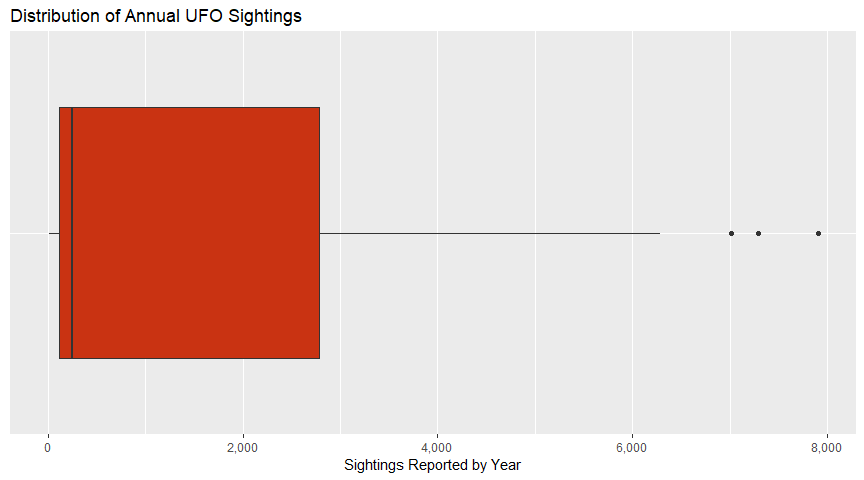<!-- -->

All of this put together, we can see that the period of time that began
in the mid-1990s really was quite exceptional by any stretch. This may
be chalked up to the ease of reporting as people gained more ready
access to home computers and NUFORC itself became easier to reach
through the internet whenever its website went live. Although, I don’t
know that this really accounts for the steep decline in more recent
years. Factors like public awareness of NUFORC probably roll into this
as well.

If we look at what time of day these sightings are occurring, we see
that about 25% would qualify as one of Hynek’s daylight disks - the vast
majority of sightings take place in the low visibility of night hours.
This fits the generally accepted image most people have in mind when
thinking of a UFO sighting.
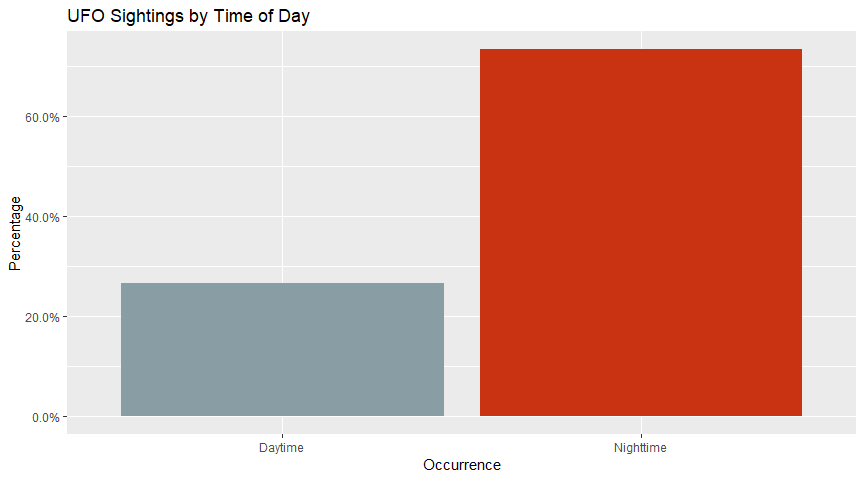<!-- -->

Additionally, we can see below that separating the dates by quarters
(starting with January), most sightings are occurring in the months of
July, August and September. Because (as seen in the “where” section
below) we know that the overwhelming majority of these recorded
sightings are in North America, there isn’t very much confusion going on
as a result of hemispheric differences. Meaning, those months are the
Summer season, and people are probably outside more often and thus more
likely to see something strange in the skies.
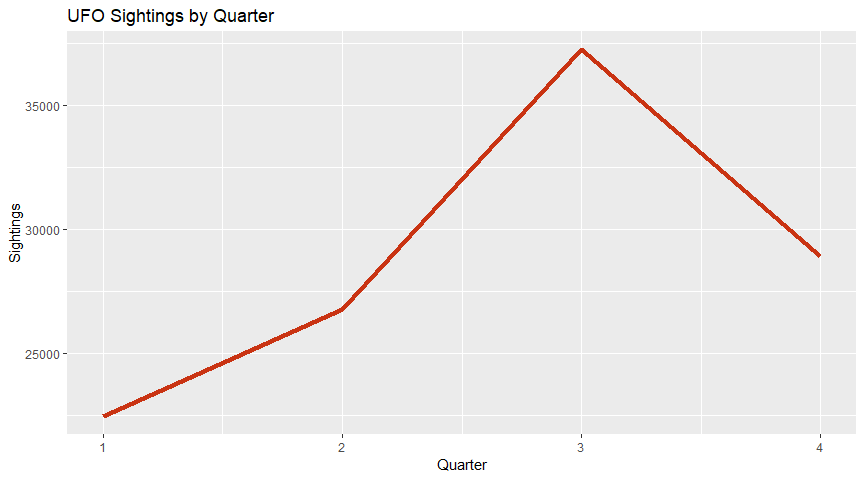<!-- -->

Generally, we see that the likelihood of seeing a UFO escalates from
6:00pm onwards at a very accelerated rate. The peak time is somewhere
between 8:00pm and 10:00pm, with sightings sharply declining after
10:00pm. 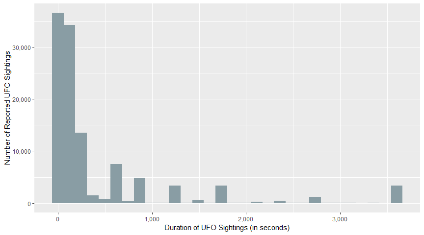<!-- -->

## UFO Sightings: How?

The data includes a number of variables useful to answering questions
that float around the “how” of UFO sightings. In this case, I will start
with the most easily accessible which is data on how long witness report
seeing their UFOs. Generally speaking, these events are described in the
popular imagination as confusing, fleeting experiences and I do not
anticipate lengthy time frames for most observations.

### Inspecting (non-missing) time/durations of sightings

In fact, we can see that there are a small number of reports (~ 2.7%) in
the processed data that are longer than an hour. These will be put aside
for later work as they are exceptional and make getting a handle of the
remaining 97.3% of records difficult. A cursory glance at the isolated
data suggests that missing time experiences are also being reported, but
those can be explored later on as those begin to hedge on the level of
the Hynek Scale’s CE-III.

Generating a histogram based on the 97% of processed UFO sightings, we
see the duration of these events is highly right-skewed.
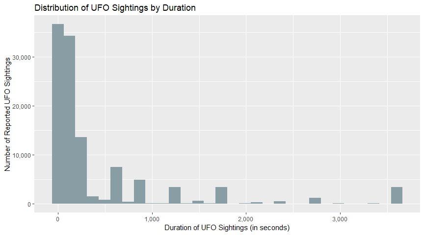<!-- -->

Considering that any particular observation was the result of an eye
witness’ reporting an unexpected event, the duration variable can be
thought of as discrete. Very few participants likely timed their
sighting in the moment and so we can assume that these are likely
estimated, general figures. While not a histogram, we see below the rate
at which any particular estimated time, in seconds, was reported to
NUFORC for about 90% of the processed data. From this, we can say that
just over half of all sightings (54%) do not last more than 3 minutes.
Additionally, only 25% ever go over 15 minutes.

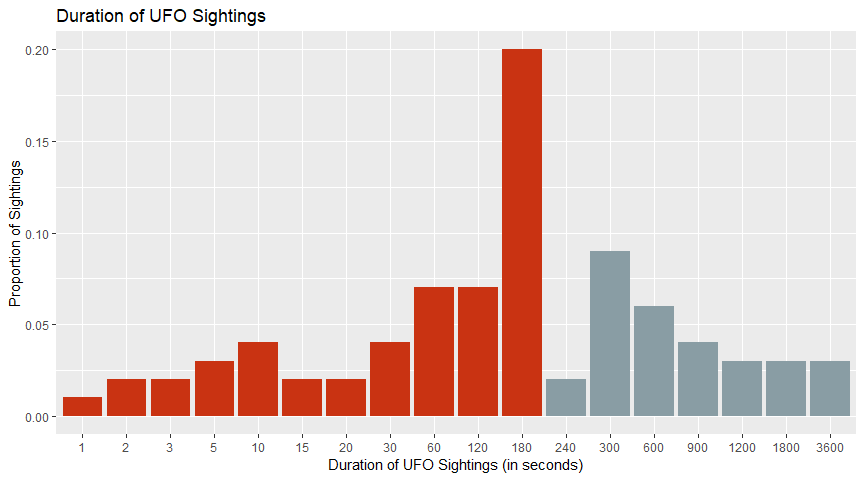<!-- -->

The results of this section confirm the typical narrative of a brief
glimpse at a strange thing in the night sky, which even if mundane in
most cases was not viewed long enough for an observer to positively
identify as such.

## UFO Sightings: Where?

Considering NUFORC is based in the U.S., it may not be a surprise that
we see the overwhelming majority of sightings originate from there as
well. However, seeing how so few reports come in from outside the U.S.,
I will assume that this is because there are either other entities
handling similar services abroad or that UFO-people outside of the U.S.
are generally less aware of/less likely to contact NUFORC. I will revist
this to see why values for countries outside of the U.S. and Canada are
not currently making it through my processing step, although for now it
is not a high priority given the overwhelming majority of observations
are traceable to the U.S. or Canada.

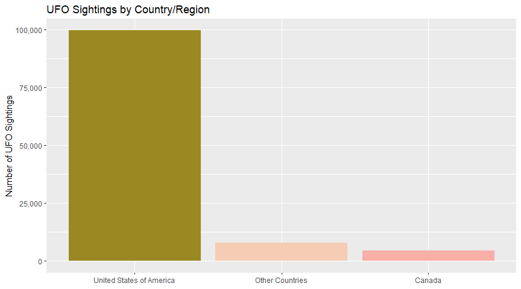<!-- -->

Looking a little closer at the U.S., we can see the all-time top ten
states for total UFO Sightings. Fitting with at least my own
preconceptions, California looks to be the clear leader in UFO
sightings. I’m a little surprised not to see more of the Southwest.
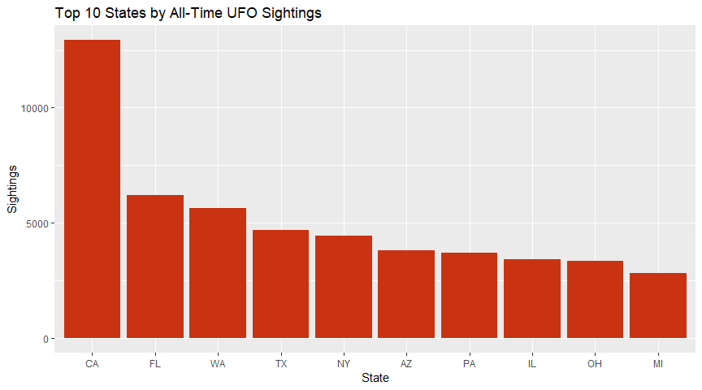<!-- -->
Inspecting the last full year recorded, we see that California is still
the clear leader though by a less significant margin.
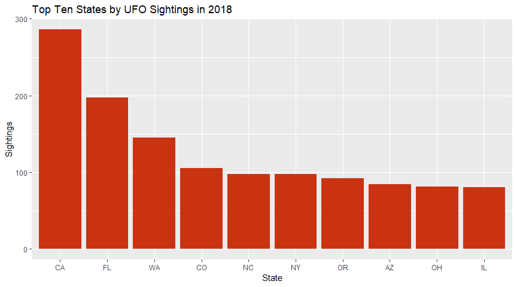<!-- -->

I need to put a bit more work into this particular theme - I feel there
is a lot of insight that could be gathered by incorporating outside data
sources - the presence of Airforce bases state-by-state would be
something useful to use in seeking a potential correlation.

## UFO Sightings: What?

Having looked at when, where and how these sightings are occuring we’re
left with really looking at what exactly the sightings themselves are.
The raw data contains quite a bit to work through, so I’ll start with
the most readily available - the UFO’s shape. As processed, the data has
22 distinct possible shapes a recorded sighting might take - that’s
quite a few and actually represents a reduced number from raw.
Alternative spellings and very similar descriptions were merged as part
of my post-scrape cleaning procedures.

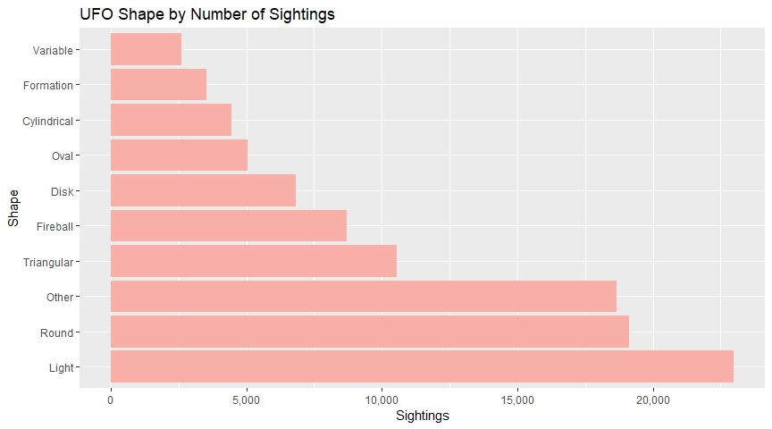<!-- -->

The visualization above shows a few things: first, that most UFOs can be
simply described as a light in the sky or a round object. Second, is
that the labels recorded by NUFORC are not hugely useful. Labels like
triangular, disk and oval, which are all very distinct descriptions or
shapes, come far less often than the simple “other.” Given the fact that
we know 75% of UFO sightings occur at night and are likely to be in
sight for three minutes or less we can assume people are not getting a
great look at these things. As only 25% occur during the day, it stands
to reason that we have way fewer sightings where someone reports a
definite shape.

Thankfully, we can actually use the summary field containing the
witness’ text description of the event to gather more information.
Processing the text moderately, we can see what the most common words
used in all recorded sightings have been - taking a bit of a leap, we
can generally say that they describe “bright orange lights moving in the
sky.” Interestingly, in a lot of the media surrounding UFOs, they color
orange is held as the standard and it certainly seems to pan out here.
This also confirms a bit of what we’ve seen in the labels - these aren’t
so much descriptions of objects as much as just the lights themselves.
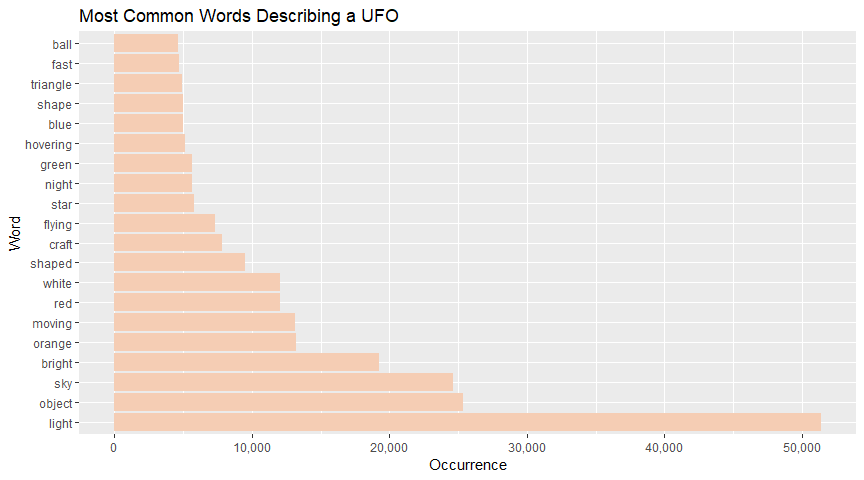<!-- -->
