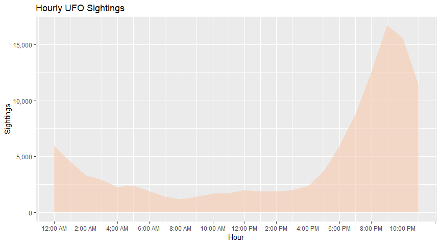

Project Notebook
================
by MoonJam

## Introduction

In the spirit of J. Allen Hynek, now that the data are processed - it’s
have a look at what we can learn about the reported UFO sightings in the
last several decades. For the purpose of this exploration, I’m
maintaining a scope of 1947 to present - using the year of the Roswell
incident as our year one.

### Limitations

I should probably set this straight from the beginning: I am not
purporting to answer any questions, but rather just take the available
data and see what can be understood from the source as collected. I do
not have any means of validating the collected data nor do I have any
connection to NUFORC or any other UFO-related organization. I’m just a
guy who works with data and thinks this is a cool and interesting topic.

## Initial analysis

Starting with a basic glance at variable summaries, there is at least
one absurd outlier for the duration of a sighting. Because I processed
the data myself, I am aware of what variables are non-text and did not
choose to inspect the variables’ types. In the very least, we can at
least verify that reports sourced from MUFON account for a negligible
amount of the
    data.

    ##    Date/Time                      Duration         MUFON Report   
    ##  Min.   :1947-01-01 17:00:00   Min.   :      0.0   Mode :logical  
    ##  1st Qu.:2003-02-20 22:11:15   1st Qu.:     60.0   FALSE:115139   
    ##  Median :2009-06-30 14:00:00   Median :    180.0   TRUE :193      
    ##  Mean   :2006-12-11 14:01:26   Mean   :    773.4                  
    ##  3rd Qu.:2014-01-17 22:56:15   3rd Qu.:    480.0                  
    ##  Max.   :2019-03-29 07:53:00   Max.   :2988000.0

## UFO Sightings: When?

In *The UFO Experience*, J. Allen Hynek states that UFO sightings in the
1960s/1970s were on the rise. Recently, I have come across a number of
references to the lack of modern sightings in various comments, threads,
etc. for UFO-related media. Observing the number of sightings over time,
we can see that Hynek’s assertion seems reasonable considering a
publication date of 1972 for *The UFO Experience*. However, it looks
like there were two flaps occuring after 1994 and 2010 and subsequently
a steep decline since 2014. Despite this, it seems that the last decade
has had more reported UFO sightings than back in Hynek’s day.
<!-- -->

Knowing the trend in yearly sightings has changed substantially over the
last few decades, I thought it wise to inspect the distribution of
sightings by year. Limiting myself to just the United States (more on
this in a later section), we can see that the data fall in a non-normal
distribution. The bottom 50% of observed years reach about 242 sightings
with the bottom 75% hitting about 2,714 sightings. Observing and
quantifying the non-normal distribution below, it is a safer bet to use
the median as the measure of central tendency, which again lands us at
about 242 sightings in a typical year in the U.S.
<!-- -->

All of this put together, we can see that the period of time that began
in the mid-1990s really was quite exceptional by any stretch. This may
be chalked up to the ease of reporting as people gained more ready
access to home computers and NUFORC itself became easier to reach
through the internet whenever its website went live. Although, I don’t
know that this really accounts for the steep decline in more recent
years. Even isolating to just the available months of the current year,
it looks like every year since at least 2015 has shown a steady decline
of reported sightings.

## UFO Sightings: How?

The data includes a number of variables useful to answering questions
that float around the “how” of UFO sightings. In this case, I will start
with the most easily accessible which is data on how long witness report
seeing their UFOs. Generally speaking, these events are described in the
popular imagination as confusing, fleeting experiences and I do not
anticipate lengthy time frames for most observations.

### Inspecting (non-missing) time/durations of sightings

In fact, we can see that there are a small number of reports (~ 2.7%) in
the processed data that are longer than an hour. These will be put aside
for later work as they are exceptional and make getting a handle of the
remaining 97.3% of records difficult. A cursory glance at the isolated
data suggests that missing time experiences are also being reported, but
those can be explored later on as those begin to hedge on the level of
the Hynek Scale’s CE-III.

    ## [1] "Sightings reported at over an hour: 2.68%"

Generating a histogram based on the 97% of processed UFO sightings, we
see the duration of these events is highly right-skewed.
<!-- -->

Considering that any particular observation was the result of an eye
witness’ reporting an unexpected event, the duration variable can be
thought of as discrete. Very few participants likely timed their
sighting in the moment and so we can assume that these are likely
estimated, general figures. While not a histogram, we see below the rate
at which any particular estimated time, in seconds, was reported to
NUFORC for about 90% of the processed data. From this, we can say that
just over half of all sightings (54%) do not last more than 3 minutes.
Additionally, only 25% ever go over 15 minutes.

<!-- -->

For now, I’m pretty satisfied in this section. The results confirm the
typical narrative of a brief glimpse at a strange thing in the sky,
which even if mundane in most cases was not viewed long enough for an
observer to positively identify as such. I think this variable coupled
with the summary variable that contains the observer’s description of
the event will prove pretty interesting whenever I get to it.

## UFO Sightings: Where?

Considering NUFORC is based in the U.S., it may not be a surprise that
we see the overwhelming majority of sightings originate from there as
well. However, seeing how so few reports come in from outside the U.S.,
I will assume that this is because there are either other entities
handling similar services abroad or that UFO-people outside of the U.S.
are generally less aware of/less likely to contact NUFORC. I will revist
this to see why values for countries outside of the U.S. and Canada are
not currently making it through my processing step, although for now it
is not a high priority given the overwhelming majority of observations
are traceable to the U.S. or Canada.

<!-- -->
